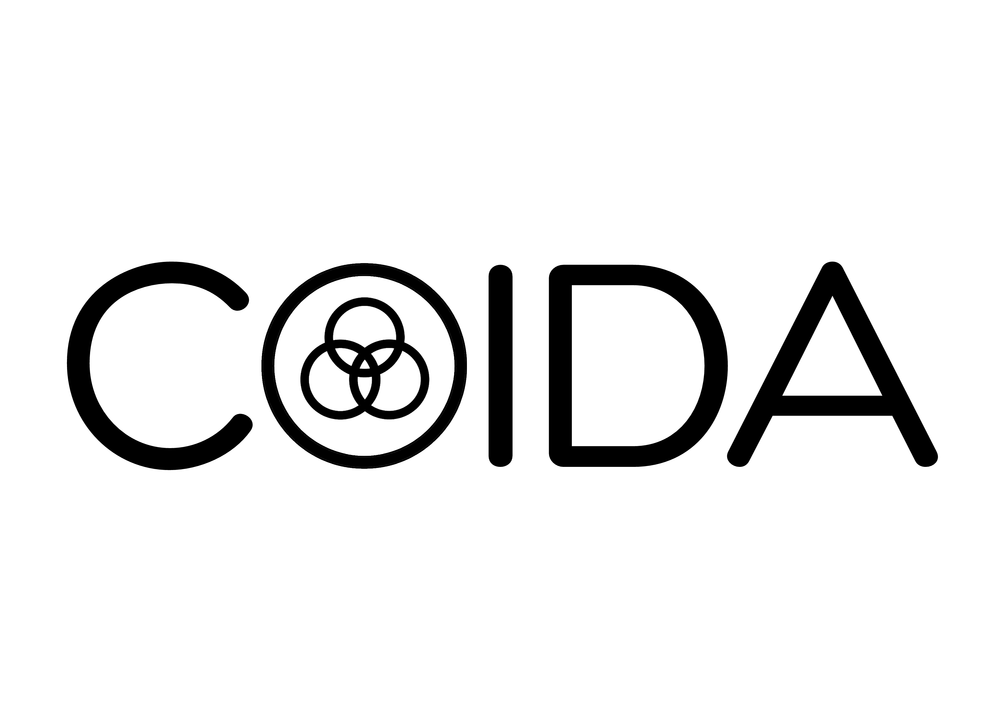

<p align="center">
    <br>
    
    <br>
<p align="center"><em><strong>Col</strong>laborative <strong>D</strong>ata  <strong>A</strong>nalysis for All</em></p>

## Introduction
ColDA  is an open source project aimed at providing distributed machine learning tools for data analysis and machine learning based on [Assisted Learning](https://assisted-learning.org/).

## Features

-  Algorithm
- Frontend
- Backend
- Package

## Algorithm

The project uses [Gradient Assisted Learning](https://github.com/diaoenmao/GAL-Gradient-Assisted-Learning-for-Decentralized-Multi-Organization-Collaborations) as the fundamental algorithm for collaboratively training distributed models.

## Frontend

- HTML
- CSS
- JavaScript
- Vue.js

### Getting Started

To set up and run the frontend portion of the project, follow these steps:

1. Clone the repository: `git clone https://github.com/your-username/AwesomeImageProcessing.git`
2. Navigate to the frontend directory: `cd AwesomeImageProcessing/frontend`
3. Install dependencies: `npm install`
4. Start the development server: `npm start`
5. Open your browser and visit `http://localhost:3000` to access the application.

## Backend

- Python
- Flask

### Getting Started

To set up and run the backend portion of the project, follow these steps:

1. Navigate to the backend directory: `cd AwesomeImageProcessing/backend`
2. Create a virtual environment: `python3 -m venv env`
3. Activate the virtual environment:
   - For macOS/Linux: `source env/bin/activate`
   - For Windows: `env\Scripts\activate.bat`
4. Install the required dependencies: `pip install -r requirements.txt`
5. Start the backend server: `python app.py`
6. The backend server should now be running on `http://localhost:5000`.

## Package

- Python

### Installation

To install the coda package, use the following command:

```shell
pip install colda
```

## License

ColDA is licensed under the [Apache 2.0 License](LICENSE).

## Code of Conduct

Please review and adhere to the [Code of Conduct](CODE_OF_CONDUCT.md) when contributing to ColDA.


## Citation
Please use the following reference
```bibtex
@article{diao2022gal,
  title={GAL: Gradient Assisted Learning for Decentralized Multi-Organization Collaborations},
  author={Diao, Enmao and Ding, Jie and Tarokh, Vahid},
  journal={Advances in Neural Information Processing Systems},
  volume={35},
  pages={11854--11868},
  year={2022}
}
```


